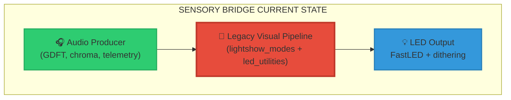
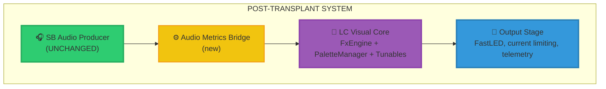
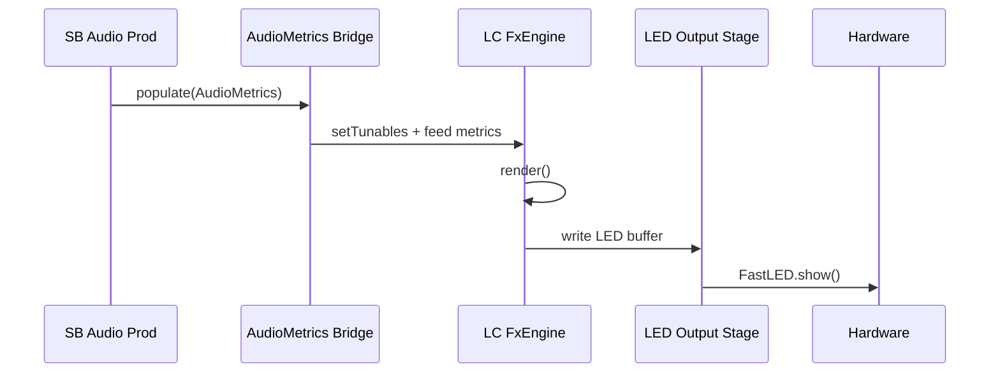
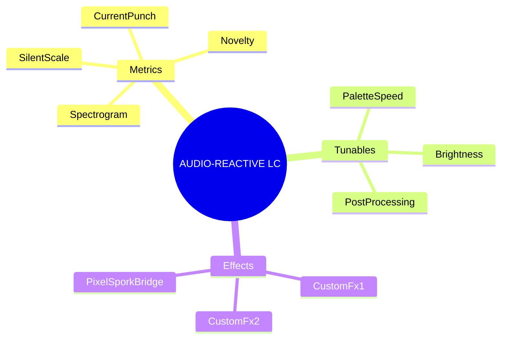

# ⚡ Light Crystals Visual Pipeline Transplant Manual

```
██████╗   █████╗  ██╗      ██╗        ██████╗   █████╗   ██████╗
██╔══██╗ ██╔══██╗ ██║      ██║        ██╔═══╝   ██╔══██╗ ██╔════╝
██████╔╝ ███████║ ██║      ██║        ██████╗   ███████║ ██║     
██╔══██╗ ██╔══██║ ██║      ██║        ╚═══██║   ██╔══██║ ██║     
██████╔╝ ██║  ██║ ██████╗  ██████╗    ███████╗  ██║  ██ ╚██████╗
╚═════╝  ╚═╝  ╚═╝ ╚═════╝  ╚═════╝    ╚═════╝   ╚═╝  ╚═╝ ╚═════╝
                       VISUAL PIPELINE TRANSPLANT MANUAL
```

> **Mission**: Extract the decaying Sensory Bridge (SB) visual pipeline and graft in the modular Light Crystals (LC) system without damaging our rock-solid audio producer or telemetry organs.

---

## 🌐 Strategic Overview

### 🎯 Mission Objectives
```
┌─────────────────────────────────────────────────────┐
│              TRANSPLANT CHECKLIST                   │
├─────────────────────────────────────────────────────┤
│ ✓ Preserve SB audio pipeline + telemetry            │
│ ✓ Embed LC visual core alongside existing systems   │
│ ✓ Bridge SB audio metrics into LC runtime           │
│ ✓ Swap render loop to LC without regressions        │
│ ✓ Retire legacy VP code safely                      │
│ ✓ Enable future audio-reactive LC effects           │
└─────────────────────────────────────────────────────┘
```

### 🧬 System Anatomy (Before Surgery)


### 🧠 Target Architecture (After Surgery)


---

## 🗺️ Surgical Phases & Milestones

| Phase | Codename | Objective | Primary Deliverable |
|-------|----------|-----------|----------------------|
| **0** | `PREP-ROOM` | Snapshot + guardrails | Branch created, telemetry untouched |
| **1** | `IMPORT-LC` | Introduce LC modules (isolated) | `src/lc/**` compiles, legacy VP untouched |
| **2** | `BRIDGE-LABS` | Map SB config + audio metrics | `AudioMetrics` exporter + tunable sync |
| **3** | `HEART-SWAP` | Replace render loop | `render_lc_frame()` powering LEDs |
| **4** | `SCAR-REMOVAL` | Excise legacy VP | Old files deleted, docs updated |
| **5** | `AUDIO-REACTOR` | Add audio-driven LC effects | Effects consuming metrics + tests |

Each phase must pass `pio run`. Hardware smoke tests recommended after Phases 3 and 5.

---

## 🧰 Phase Playbooks

### Phase 0 – `PREP-ROOM`
1. **Branch**: `git checkout -b feature/lc-transplant`.
2. **Record Baseline**: `git status -sb` and note telemetry files under `src/debug/`.
3. **Tag Critical Modules**: Audio producer (`i2s_audio.h`, `GDFT*.h`, `audio_*`), LED thread (`src/main.cpp`), telemetry scaffolding.

```
⚠️ NON-NEGOTIABLE SAFETY PROTOCOLS
- Do not modify telemetry when scaffolding LC modules.
- Snapshot `docs/firmware/pipelines.md` for later update.
```

### Phase 1 – `IMPORT-LC`

1. Create `src/lc/` and import:
   - `core/FxEngine.h`
   - `core/PaletteManager.{h,cpp}`
   - `core/RuntimeTunables.{h,cpp}`
   - `utils/FastLEDLUTs.h`, `utils/PerformanceMetrics.h`, `utils/StripMapper.h`
   - `effects/{basic,advanced,pipeline}` (skip PixelSpork for now)
   - `Globals.cpp` LED buffer definitions (rename namespace to avoid collision)
2. Replace LC `FEATURE_*` macros with SB-specific flags in a new `lc/config.h`:
   ```cpp
   #pragma once
   #define SB_LC_ENABLE_PIXELSPORK 0
   #define SB_LC_ENABLE_ENCODERS 0
   #define SB_LC_ENABLE_SERIAL_MENU 0
   ```
3. Adjust includes so LC code compiles independently. Confirm `pio run` passes.

### Phase 2 – `BRIDGE-LABS`
```
┌─────────────────────────────────────────────┐
│           AUDIO METRICS BRIDGE              │
├─────────────────────────────────────────────┤
│ struct AudioMetrics {                       │
│   float spectrogram[NUM_FREQS];             │
│   float chroma[12];                         │
│   float silentScale;                        │
│   float currentPunch;                       │
│   bool  silence;                            │
│   ...                                       │
│ };                                          │
└─────────────────────────────────────────────┘
```
1. **Create `AudioMetrics`** in a new header `src/lc/audio_bridge.h`.
2. **Exporter**: Implement `collect_audio_metrics(AudioMetrics&)` using existing globals (e.g., `spectrogram_smooth`, `silent_scale`).
3. **Tunable Sync**: Add `apply_sb_config_to_lc()` that maps `CONFIG` values to `RuntimeTunables` (photons → brightness, saturation → palette tweaks, etc.).
4. **Integration Stub**: In `src/main.cpp`, call both helper functions before the legacy render step (no behaviour change yet). Log sample metrics to confirm output.

### Phase 3 – `HEART-SWAP`

1. **Create `render_lc_frame()`** in `src/lc/render.cpp`:
   ```cpp
   void render_lc_frame() {
       lc::AudioMetrics metrics;
       collect_audio_metrics(metrics);
       apply_sb_config_to_lc(metrics);
       lc::fxEngine.render();
       lc::apply_post_processing(metrics);
   }
   ```
2. **LED Thread Swap**: In `led_thread` (`src/main.cpp`), wrap the legacy render call:
   ```cpp
   if (SB_ENABLE_LC_RENDER) {
       render_lc_frame();
   } else {
       legacy_render_frame();
   }
   ```
3. **Buffer Management**:
   - Decide on buffer reconciliation: either reuse LC `leds[]` and convert to `leds_16`, or re-point our output stage to `CRGB` arrays.
   - Ensure brightness floors, current limiting, and telemetry remain in place.
4. **Smoke Test**: With SB audio idle, verify static LC effects show up on hardware. Log telemetry around `render_lc_frame()` to maintain metrics.

### Phase 4 – `SCAR-REMOVAL`
1. Once LC rendering is stable, delete or archive legacy modules:
   - `src/lightshow_modes.*`
   - Palette bridge (`palettes_bridge.h`, `src/palettes/`)
   - Unused sections of `led_utilities.*`
2. Remove unused constants/macros from `src/constants.h`.
3. Update documentation:
   - Replace Visual Pipeline section in `docs/firmware/pipelines.md` with LC architecture.
   - Add reference to this manual.
4. Run `pio run` and perform hardware regression to confirm no behavioural drift.

### Phase 5 – `AUDIO-REACTOR`

1. Extend `AudioMetrics` consumers:
   - Map `currentPunch` → LC `paletteSpeed` or effect speed.
   - Use spectrogram energy to modulate brightness/vignettes.
2. Implement new LC effects in `src/lc/effects/audio_*.{h,cpp}` that read metrics directly.
3. Re-enable optional middleware (`SB_LC_ENABLE_PIXELSPORK`) and ensure metrics are forwarded through adapters.
4. Hardware validation with test audio tracks; record telemetry snapshots.

---

## 🔍 File & Module Field Guide

| Component | Legacy Location | LC Counterpart / Action |
|-----------|-----------------|-------------------------|
| Audio producer | `src/i2s_audio.h`, `src/GDFT*.h`, `audio_*` | **Preserve**; expose metrics via bridge |
| Legacy visuals | `src/lightshow_modes.*`, `src/led_utilities.*` | **Phase 4 removal** |
| LC core | `src/lc/core/**` | Imported in Phase 1 |
| Effects | `src/lc/effects/**` | Imported; expand with audio-reactive variants |
| Post-processing | `src/lc/main/applyPostProcessing` | Adapted into `render_lc_frame()` |
| LED output | `src/main.cpp`, `src/led_utilities.*` | Retain current limiting + telemetry |
| Documentation | `docs/firmware/pipelines.md` | Update in Phase 4 |

---

## 🧪 Validation Checklist

| Phase | Command | Expected Outcome |
|-------|---------|------------------|
| 1 | `pio run` | Build succeeds with LC modules compiled |
| 2 | `pio run` + telemetry log | Metrics printed (non-zero spectrogram, punch, etc.) |
| 3 | Hardware smoke test | LC effects visible, telemetry intact |
| 4 | `pio run` | Legacy files removed, docs updated |
| 5 | Audio tests | Effects react to audio, telemetry stable |

**Continuous Integration Hooks (optional):** Create temporary unit tests or mock harnesses for `AudioMetrics` to catch regressions.

---

## ❗ Non-Negotiable Surgical Rules
```
1. AUDIO PIPELINE IS SACRED – no edits unless explicitly required.
2. TELEMETRY MUST SURVIVE – migrate trace events to LC stages.
3. CENTER-ORIGIN PHILOSOPHY – LC effects should respect existing LED symmetry.
4. PIXELSPORK OPTIONAL – do not introduce new mandatory dependencies.
5. FAIL FAST – if `pio run` fails, halt and fix before advancing.
```

---

## 🚀 Launch Checklist
```
[ ] Branch created and baseline recorded
[ ] LC modules imported under `src/lc/`
[ ] Audio metrics bridge implemented
[ ] `render_lc_frame()` integrated (flagged)
[ ] Legacy VP removed post-validation
[ ] Documentation & telemetry updated
[ ] Audio-reactive effects delivered
```

> **Battle Cry**: *“Transplant with precision. Preserve what works. Unleash Light Crystals.”*

Once these boxes are checked, the Sensory Bridge firmware will run the LC visual pipeline with a clean codebase and a clear highway for future audio-reactive brilliance.
