# ⚡ Light Crystals Visual Pipeline Transplant Manual

```
██████╗   █████╗  ██╗      ██╗        ██████╗   █████╗   ██████╗
██╔══██╗ ██╔══██╗ ██║      ██║        ██╔═══╝   ██╔══██╗ ██╔════╝
██████╔╝ ███████║ ██║      ██║        ██████╗   ███████║ ██║     
██╔══██╗ ██╔══██║ ██║      ██║        ╚═══██║   ██╔══██║ ██║     
██████╔╝ ██║  ██║ ██████╗  ██████╗    ███████╗  ██║  ██ ╚██████╗
╚═════╝  ╚═╝  ╚═╝ ╚═════╝  ╚═════╝    ╚═════╝   ╚═╝  ╚═╝ ╚═════╝
                       VISUAL PIPELINE TRANSPLANT MANUAL
```

> **Mission**: Extract the decaying Sensory Bridge (SB) visual pipeline and graft in the modular Light Crystals (LC) system without damaging our rock-solid audio producer or telemetry organs.

> **Status**: Phases 0–3 are complete — LC now drives the LEDs on hardware. Phase 4 cleanup and Phase 5 audio-reactive expansion remain.

### ✅ Current Deployment Snapshot
- LC render path (`render_lc_frame()` in `src/lc/runtime.cpp`) is live behind `SB_ENABLE_LC_RENDER = 1` and maintains telemetry handshakes.
- Palette bridge uses the shared `src/palettes/Palettes_Crameri.h`; LC `PaletteManager` refreshes SB palettes each frame.
- HMI stack is running the single Scroll unit on SDA=3/SCL=4 (see `src/hmi/dual_encoder_controller.*`), with encoder diagnostics trimmed for normal runs.

---

## 🌐 Strategic Overview

### 🎯 Mission Objectives
```
┌─────────────────────────────────────────────────────┐
│              TRANSPLANT CHECKLIST                   │
├─────────────────────────────────────────────────────┤
│ ✓ Preserve SB audio pipeline + telemetry            │
│ ✓ Embed LC visual core alongside existing systems   │
│ ✓ Bridge SB audio metrics into LC runtime           │
│ ✓ Swap render loop to LC without regressions        │
│ ✓ Retire legacy VP code safely                      │
│ ✓ Enable future audio-reactive LC effects           │
└─────────────────────────────────────────────────────┘
```

### 🧬 System Anatomy (Before Surgery)

```mermaid
flowchart TD
    subgraph "SENSORY BRIDGE CURRENT STATE"
        A["🎧 Audio Producer\n(GDFT, chroma, telemetry)"]
        B["🎨 Legacy Visual Pipeline\n(lightshow_modes + led_utilities)"]
        C["💡 LED Output\nFastLED + dithering"]
    end

    A --> B --> C

    style A fill:#2ecc71,stroke:#27ae60,stroke-width:2px
    style B fill:#e74c3c,stroke:#c0392b,stroke-width:3px
    style C fill:#3498db,stroke:#2980b9,stroke-width:2px
```


### 🧠 Target Architecture (After Surgery)

```mermaid
flowchart TD
    subgraph "POST-TRANSPLANT SYSTEM"
        A["🎧 SB Audio Producer\n(UNCHANGED)"]
        B["⚙️ Audio Metrics Bridge\n(new)"]
        C["🌈 LC Visual Core\nFxEngine + PaletteManager + Tunables"]
        D["🔧 Output Stage\nFastLED, current limiting, telemetry"]
    end

    A --> B --> C --> D

    style A fill:#2ecc71,stroke:#27ae60,stroke-width:3px
    style B fill:#f1c40f,stroke:#f39c12,stroke-width:2px
    style C fill:#9b59b6,stroke:#8e44ad,stroke-width:3px
    style D fill:#3498db,stroke:#2980b9,stroke-width:3px
```


---

## 🗺️ Surgical Phases & Milestones

| Phase | Codename | Objective | Primary Deliverable | Status |
|-------|----------|-----------|----------------------|--------|
| **0** | `PREP-ROOM` | Snapshot + guardrails | Branch created, telemetry untouched | ✅ Complete |
| **1** | `IMPORT-LC` | Introduce LC modules (isolated) | `src/lc/**` compiles, legacy VP untouched | ✅ Complete |
| **2** | `BRIDGE-LABS` | Map SB config + audio metrics | `AudioMetrics` exporter + tunable sync | ✅ Complete |
| **3** | `HEART-SWAP` | Replace render loop | `render_lc_frame()` powering LEDs | ✅ Complete |
| **4** | `SCAR-REMOVAL` | Excise legacy VP | Old files deleted, docs updated | 🟡 In progress |
| **5** | `AUDIO-REACTOR` | Add audio-driven LC effects | Effects consuming metrics + tests | ⏳ Planned |

Each phase must pass `pio run`. Hardware smoke tests recommended after Phases 3 and 5.

---

## 🧰 Phase Playbooks

### Phase 0 – `PREP-ROOM` (✅ Completed)
> Implementation summary: Baseline snapshot captured and telemetry guardrails verified before LC import. Steps below are retained for reference on future ports.
1. **Branch**: `git checkout -b feature/lc-transplant`.
2. **Record Baseline**: `git status -sb` and note telemetry files under `src/debug/`.
3. **Tag Critical Modules**: Audio producer (`i2s_audio.h`, `GDFT*.h`, `audio_*`), LED thread (`src/main.cpp`), telemetry scaffolding.

```
⚠️ NON-NEGOTIABLE SAFETY PROTOCOLS
- Do not modify telemetry when scaffolding LC modules.
- Snapshot `docs/firmware/pipelines.md` for later update.
```

### Phase 1 – `IMPORT-LC` (✅ Completed)
> Implementation summary: LC core/effects/utils now live under `src/lc/`, linked via feature flags and building cleanly under PlatformIO. Notes below remain as a migration log.

```mermaid
flowchart LR
    A["📁 Reference.docs/src.LC"] --> B["🔁 Copy essential LC modules"]
    B --> C["🧩 Wrap optional systems\n(PixelSpork, encoders) with SB flags"]
    C --> D["🛠️ Ensure `pio run` success"]
```

1. Create `src/lc/` and import:
   - `core/FxEngine.h`
   - `core/PaletteManager.{h,cpp}`
   - `core/RuntimeTunables.{h,cpp}`
   - `utils/FastLEDLUTs.h`, `utils/PerformanceMetrics.h`, `utils/StripMapper.h`
   - `effects/{basic,advanced,pipeline}` (skip PixelSpork for now)
   - `Globals.cpp` LED buffer definitions (rename namespace to avoid collision)
2. Replace LC `FEATURE_*` macros with SB-specific flags in a new `lc/config.h`:
   ```cpp
   #pragma once
   #define SB_LC_ENABLE_PIXELSPORK 0
   #define SB_LC_ENABLE_ENCODERS 0
   #define SB_LC_ENABLE_SERIAL_MENU 0
   ```
3. Adjust includes so LC code compiles independently. Confirm `pio run` passes.

**Exit Criteria**
- `src/lc/` contains imported LC core (`core/`, `effects/`, `utils/`, `Globals.cpp`) wrapped with SB-specific config flags.
- `pio run` succeeds with `SB_ENABLE_LC_RENDER` undefined.
- Telemetry scaffolding in `src/debug/` untouched, preserving baseline instrumentation.

### Phase 2 – `BRIDGE-LABS` (✅ Completed)
> Implementation summary: `AudioMetrics` bridge (`src/lc/audio_bridge.{h,cpp}`) maps SB telemetry into LC tunables and is exercised each frame before rendering. Details below document the bridge for future extensions.
```
┌─────────────────────────────────────────────┐
│           AUDIO METRICS BRIDGE              │
├─────────────────────────────────────────────┤
│ struct AudioMetrics {                       │
│   float spectrogram[NUM_FREQS];             │
│   float chroma[12];                         │
│   float silentScale;                        │
│   float currentPunch;                       │
│   bool  silence;                            │
│   ...                                       │
│ };                                          │
└─────────────────────────────────────────────┘
```
- `AudioMetrics` lives in `src/lc/audio_bridge.h` and captures spectrogram, chroma, punch, and silence data from SB producers.
- `collect_audio_metrics()` reads shared globals (e.g., `spectrogram_smooth`, `audio_vu_level`) and normalises into LC-friendly floats.
- `apply_sb_config_to_lc()` syncs SB config (`CONFIG.PHOTONS`, `CONFIG.SATURATION`, etc.) into LC runtime tunables each frame.
- `render_lc_frame()` invokes both helpers prior to `fxEngine.render()`, keeping the legacy path accessible via `legacy_render_frame()` for comparison.

**SB → LC Metric Bridge Cheat-Sheet**
| SB Source | Symbol & Location | Range / Units | LC Consumer | Notes |
|-----------|------------------|---------------|-------------|-------|
| Smoothed spectrogram | `spectrogram_smooth[NUM_FREQS]` (`src/GDFT.h`) | `SQ15x16` 0.0–1.0 | `AudioMetrics::spectrogram` → LC spectral helpers | Cast to float; extend LC effects to consume via `FxEngine::setSpectralInput` patterns.
| Chromagram energy | `chromagram_smooth[12]` (`src/GDFT.h`) | `float` 0.0–1.0 | `AudioMetrics::chroma` → note-reactive effects | Maintains SB note order (C→B).
| Silent scaler | `silent_scale` (`src/i2s_audio.h`) | `float` 0.0–10.0 | LC silence gating | Clamped to 0.0–4.0 before handing to runtime tunables.
| Audio punch | `audio_vu_level` (`src/i2s_audio.h`) | `SQ15x16` 0.0–1.0 | Effect speed / bloom modulation | Serves as the primary beat proxy for LC.
| Waveform intensity | `audio_processed_state` peak followers (`max_waveform_val_*`) | `float` 0.0–32767 | Optional per-effect intensity | Helper normalises to 0.0–1.0; extend consumers as needed.
| Config brightness | `CONFIG.PHOTONS` (`src/core/globals.cpp`) | `float` 0.0–1.0 | LC brightness control | Runtime guard enforces SB minimum brightness before `FastLED.setBrightness`.
| Palette saturation | `CONFIG.SATURATION` (`src/core/globals.cpp`) | `float` 0.0–1.0 | LC palette shaping | Palette tuning enabled when SB toggles palette curation.

**Exit Criteria**
- `collect_audio_metrics()` serial dump shows non-zero metrics with audio playing.
- Adjusting serial menu brightness or saturation updates LC tunables in real time.
- Legacy render path remains bit-for-bit identical with LC bridge enabled but LC render disabled.

### Phase 3 – `HEART-SWAP` (✅ Completed)
> Implementation summary: LC now renders every frame, with palette refresh + CRGB→CRGB16 copy validated on hardware. Notes below document the wiring and serve as regression guidance.

- `render_lc_frame()` in `src/lc/runtime.cpp` gathers audio metrics, updates palette state, renders via `fxEngine`, and copies CRGB output into SB’s `CRGB16` buffers:
  ```cpp
  void render_lc_frame(const AudioMetrics& metrics) {
    (void)metrics;
    ensure_initialized();
    paletteManager.updatePaletteBlending();
    refresh_palette_state();
    fxEngine.render();
    copy_to_sb_buffers();
  }
  ```
- The LED thread (`led_thread` in `src/main.cpp`) swaps between LC and legacy rendering with `SB_ENABLE_LC_RENDER`, preserving the handshake (`begin_frame()`, `publish_frame()`, `show_leds()`).
- `copy_to_sb_buffers()` scales CRGB 0–255 into `SQ15x16` and mirrors into `leds_16_prev` / `leds_16_fx`, ensuring SB post-processing and telemetry stay intact.
- Hardware smoke tests show non-zero `[LC]` / `[LC->SB]` logs, with encoder input modulating brightness/scene selection via the LC tunables.

**Exit Criteria**
- `SB_ENABLE_LC_RENDER` runtime toggle flips between legacy and LC output without rebooting.
- LC render path sustains ≥45 FPS in `perf_metrics.led_fps`.
- Telemetry packets (`TRACE_CAT_LED`) record frame transitions in both modes.
- Bench test shows static LC palette and at least one audio-reactive LC effect responding to `current_punch`.

### Phase 4 – `SCAR-REMOVAL` (🟡 In progress)
> Focus: retire legacy visual code now that LC rendering is proven. Use the checklist below to track remaining cleanup tasks.
1. Once LC rendering is stable, delete or archive legacy modules:
   - `src/lightshow_modes.*`
   - Palette bridge (`palettes_bridge.h`, `src/palettes/`)
   - Unused sections of `led_utilities.*`
2. Remove unused constants/macros from `src/constants.h`.
3. Update documentation:
   - Replace Visual Pipeline section in `docs/firmware/pipelines.md` with LC architecture.
   - Add reference to this manual.
4. Run `pio run` and perform hardware regression to confirm no behavioural drift.

**Exit Criteria**
- Legacy visual sources (`src/lightshow_modes.*`, palettes, unused `led_utilities` helpers) removed or archived under `Reference.docs/`.
- `docs/firmware/pipelines.md` rewritten to document LC pipeline; legacy description retained only in release notes.
- No production code references `LIGHT_MODE_*` or legacy palette bridges.
- Regression run (`pio run`) and telemetry sanity checks match pre-swap baselines.

### Phase 5 – `AUDIO-REACTOR` (⏳ Planned)
> Focus: expand LC catalog with audio-reactive effects once cleanup lands. The mindmap and checklist guide the roadmap.

1. Extend `AudioMetrics` consumers:
   - Map `currentPunch` → LC `paletteSpeed` or effect speed.
   - Use spectrogram energy to modulate brightness/vignettes.
2. Implement new LC effects in `src/lc/effects/audio_*.{h,cpp}` that read metrics directly.
3. Re-enable optional middleware (`SB_LC_ENABLE_PIXELSPORK`) and ensure metrics are forwarded through adapters.
4. Hardware validation with test audio tracks; record telemetry snapshots.

**Exit Criteria**
- ≥2 LC effects under `src/lc/effects/audio_*.{h,cpp}` respond to spectrogram and punch metrics.
- Automated or scripted telemetry capture shows clear deltas between silence, pink noise, and peak content.
- PixelSpork adapter (`SB_LC_ENABLE_PIXELSPORK`) remains optional and defaults off.

---

## 🔍 File & Module Field Guide

| Component | Legacy Location | LC Counterpart / Action |
|-----------|-----------------|-------------------------|
| Audio producer | `src/i2s_audio.h`, `src/GDFT*.h`, `audio_*` | **Preserve**; expose metrics via bridge |
| Legacy visuals | `src/lightshow_modes.*`, `src/led_utilities.*` | **Phase 4 removal** |
| LC core | `src/lc/core/**` | Imported in Phase 1 |
| Effects | `src/lc/effects/**` | Imported; expand with audio-reactive variants |
| Post-processing | `src/lc/main/applyPostProcessing` | Adapted into `render_lc_frame()` |
| LED output | `src/main.cpp`, `src/led_utilities.*` | Retain current limiting + telemetry |
| Documentation | `docs/firmware/pipelines.md` | Update in Phase 4 |

---

## 🧪 Validation Checklist

| Phase | Command | Expected Outcome |
|-------|---------|------------------|
| 1 | `pio run` | Build succeeds with LC modules compiled |
| 2 | `pio run` + telemetry log | Metrics printed (non-zero spectrogram, punch, etc.) |
| 3 | Hardware smoke test | LC effects visible, telemetry intact |
| 4 | `pio run` | Legacy files removed, docs updated |
| 5 | Audio tests | Effects react to audio, telemetry stable |

**Continuous Integration Hooks (optional):** Create temporary unit tests or mock harnesses for `AudioMetrics` to catch regressions.

---

## 📡 Telemetry Preservation Targets

| Signal | Legacy Source | Migration Requirement |
|--------|---------------|-----------------------|
| `perf_metrics.frame_count`, `led_fps` | `src/performance_optimized_trace.cpp`, `src/main.cpp` | Feed LC render loop counters so dashboards stay accurate.
| Trace events (`TRACE_CAT_LED`, `TRACE_CAT_PERF`) | `begin_frame()`, `TRACE_EVENT()` calls inside `led_thread` | Mirror these around `render_lc_frame()` and LC post-processing.
| USB serial health logs | `led_thread` startup / smoke tests | Keep existing prints or gated debug hooks for regression parity.
| Telemetry packets in `src/debug/` | `debug/performance_monitor.h`, metrics exporters | Ensure bridge writes identical records, extending format only if documented.

---

## ❗ Non-Negotiable Surgical Rules
```
1. AUDIO PIPELINE IS SACRED – no edits unless explicitly required.
2. TELEMETRY MUST SURVIVE – migrate trace events to LC stages.
3. CENTER-ORIGIN PHILOSOPHY – LC effects should respect existing LED symmetry.
4. PIXELSPORK OPTIONAL – do not introduce new mandatory dependencies.
5. FAIL FAST – if `pio run` fails, halt and fix before advancing.
```

---

## 🚀 Launch Checklist
```
[x] Branch created and baseline recorded
[x] LC modules imported under `src/lc/`
[x] Audio metrics bridge implemented
[x] `render_lc_frame()` integrated (flagged)
[ ] Legacy VP removed post-validation
[ ] Documentation & telemetry updated
[ ] Audio-reactive effects delivered
```

> **Battle Cry**: *“Transplant with precision. Preserve what works. Unleash Light Crystals.”*

Once these boxes are checked, the Sensory Bridge firmware will run the LC visual pipeline with a clean codebase and a clear highway for future audio-reactive brilliance.

---

## 📎 LC Runtime Quick Reference

| Topic | Reference (`Reference.docs/src.LC`) | SB Integration Notes |
|-------|-------------------------------------|----------------------|
| LED buffers | `Globals.cpp` | Mirror `CRGB leds[NUM_LEDS]` allocation and ensure SB strip order matches LC expectations.
| Init sequence | `main.cpp::setup()` | Mirror LC order: after SB `init_system()`, call `paletteManager.begin()` → `EffectRegistry::registerAllEffects()` → `fxEngine.render()` loop; no `FxEngine::begin()` exists, so add init wrapper only if desired.
| Runtime tunables | `core/RuntimeTunables.{h,cpp}` | Add SB-facing setters during migration (e.g. `set_runtime_brightness`) or wire directly to globals while guarding telemetry.
| Performance monitor | `hardware/PerformanceMonitor.*` | Feed SB `perf_metrics` counters into LC monitor to keep dashboards consistent (extend monitor if additional fields required).
| Strip mapping LUTs | `utils/StripMapper.h` | Precompute/port `angles[]`/`radii[]` using SB geometry helpers to maintain center-origin symmetry.
| Post filters | `main.cpp::applyPostProcessing()` | Wrap LC `applyPostProcessing()` (or equivalent) and run before SB current limiting + FastLED show.

> Keep this table handy during Phase 3 wiring; it surfaces assumptions that are easy to miss when jumping between repositories.
